# Obscura (OBX)

**A privacy cryptocurrency with a *global* anonymity set — no decoys, no trusted setup.**

Obscura hides every spend among the **entire** unspent-output set: a zero-knowledge proof shows the spent coin is a member of a trustless cryptographic accumulator over *all* outputs. The anonymity set is global and grows with adoption, while membership proofs stay **constant-size** and fast to verify. Amounts are hidden with Pedersen commitments + range proofs; recipients with dual-key stealth addresses. Pure Go, single static binary per platform, canonical RandomX PoW.

- **Global anonymity set** — every spend hides among all outputs, not a ring of ~16 decoys.
- **No trusted setup** — class-group accumulator (no ceremony) + transparent, post-quantum-friendly zk-STARKs.
- **Confidential amounts & hidden recipients** — Pedersen commitments, range proofs, stealth addresses.
- **Constant-size proofs** regardless of chain size · **fair launch** (no premine, no dev fund).
- **Batteries included** — full node, CPU miner, CLI/desktop wallet, private staking vaults, and trustless OBX↔XNO atomic swaps.

## Protocol at a glance

```mermaid
flowchart TB
  subgraph Wallet
    start(["User initiates payment"])
    build["Build tx: notes, stealth output, confidential amounts"]
    prove["Generate transparent zk-STARK: membership + recipient-secret nullifier (nf=H(nk,rho); sender cannot link) + conservation + range"]
    submit["Submit signed tx to local node"]
  end

  subgraph Mempool
    admit["Verify proof, fee, anchor, reorg-safe checks"]
    gadmit{"Admissible?"}
    reject(["Reject tx"])
    reserve["Reserve nullifiers / vault keys; queue"]
  end

  subgraph P2P
    stem["Dandelion++ stem relay (p=0.30, embargo)"]
    fluff["Fluff: broadcast to peers (PEX / Tor)"]
  end

  subgraph Miner
    por["Prove retrievability: full node holds bodies in PoRWindow (8 challenges)"]
    assemble["Assemble block: select txs, apply state transition"]
    roots["Compute roots: AccValue, NullRoot, CMRoot, PQAccRoot, PoRRoot, StateRoot (pre-state)"]
    pow["Grind memory-hard PoW over header binding all 6 roots; epoch PoW seed; LWMA"]
    bcast["Broadcast solved block"]
  end

  subgraph Validation
    vpow["Re-verify PoW target + header binding"]
    vpor["Verify PoR entries (header-only)"]
    vstark["Verify each tx zk-STARK + nullifier non-membership"]
    vroots["Recompute and match all 6 header roots (incl. StateRoot)"]
    gvalid{"Block valid?"}
    drop(["Drop / ban peer"])
  end

  subgraph StateChain["State/Chain"]
    apply["Apply: accumulator add, nullifier insert, commitment-tree append"]
    gfork{"Heavier fork?"}
    reorg["Snapshot-restore + deterministic replay (bounded)"]
    extend["Extend canonical heaviest-work chain; advance tip"]
    prune["Snapshot (interval 200) + prune bodies below tip-PoRWindow"]
    canon(["Tx final in canonical chain"])
  end

  start --> build --> prove --> submit --> admit --> gadmit
  gadmit -->|no| reject
  gadmit -->|yes| reserve --> stem --> fluff --> por --> assemble --> roots --> pow --> bcast
  bcast --> vpow --> vpor --> vstark --> vroots --> gvalid
  gvalid -->|invalid| drop
  gvalid -->|valid| apply --> gfork
  gfork -->|yes| reorg --> extend
  gfork -->|no| extend
  extend --> prune --> canon
```



*(This is the full whole-protocol BPMN model; a source-editable BPMN 2.0 file ships in the desktop/download bundle and the [whitepaper](https://obscura-protocol.space/whitepaper).)*

## Download & run

Install + run a full node + miner in one command — **re-run the same line any time to upgrade** (it verifies the new build's SHA-256, replaces only the binary, and keeps your keys in `~/.obscura`):

```sh
# Linux / macOS
curl -fsSL https://obscura-protocol.space/install.sh | sh

# Windows (PowerShell)
iwr -useb https://obscura-protocol.space/install.ps1 | iex
```

Or grab a build from the **[GitHub releases](https://github.com/obscura-node/obscura/releases)** or the [download page](https://obscura-protocol.space/download) and verify it against [RELEASES.md](RELEASES.md) checksums. For a desktop wallet + swaps + mining in a window, unzip the macOS/Windows/Linux build and open it.

**Privacy by default (Tor).** The node routes its P2P over **Tor automatically** — on startup it launches a `tor` hidden service and runs *onion-only*, so peers see only your `.onion`, never your home IP (ideal for mining from home). It needs a `tor` binary on `PATH` (the installer sets this up); if tor is missing it fails closed rather than leaking your IP. Pass `--clearnet` to run as a public clearnet node instead (for seed/public nodes and CI). Details: <https://obscura-protocol.space/docs/cli>.

## Links

- **Website** — https://obscura-protocol.space
- **Whitepaper** — https://obscura-protocol.space/whitepaper
- **Docs** — https://obscura-protocol.space/docs.html (CLI: /docs/cli · API: /docs/api)
- **Source** — https://github.com/obscura-node/obscura

## License

See [LICENSE](LICENSE).
